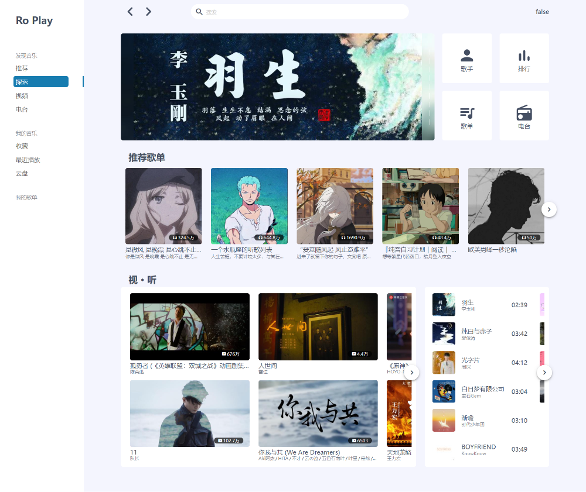

# RoPlay-music

vue3 + vite + Pinia

# 使用方法

## 部署到自己的服务器

替换`/.env`文件中 `VITE_BASE_URL` 的值为网易云 API 地址

## 部署至 Vercel

点击 Environment Variables，填写 Name 为 `VITE_BASE_URL`，Value 为 你的网易云 API 地址.

# 介绍

# DEMO

[link](https://ro-play-vue3-69xxynv91-wskkku.vercel.app/#/)
