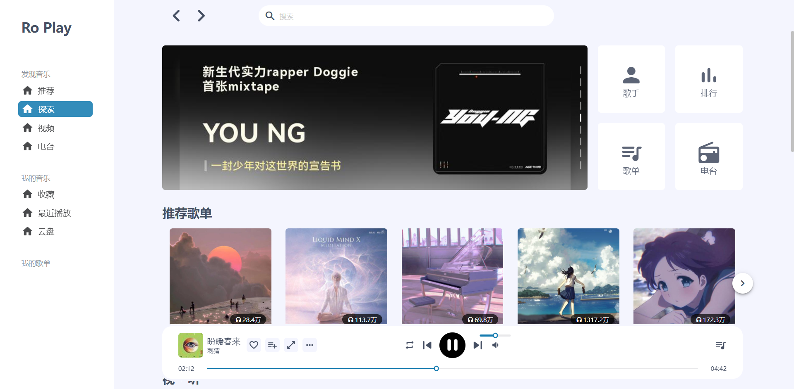
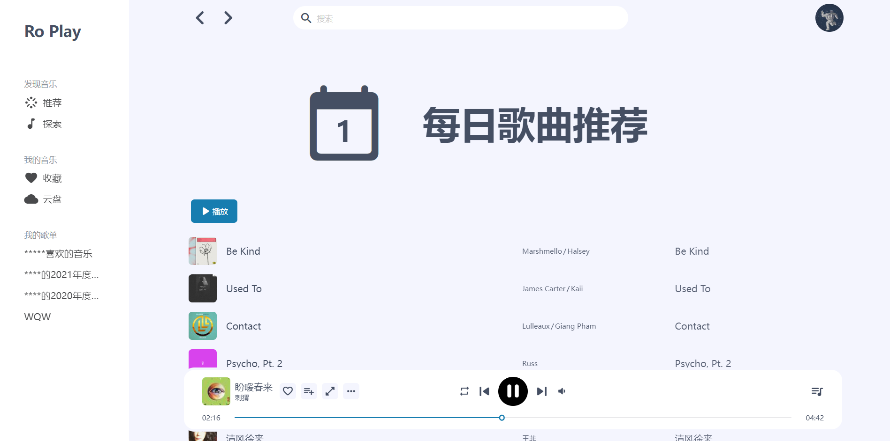
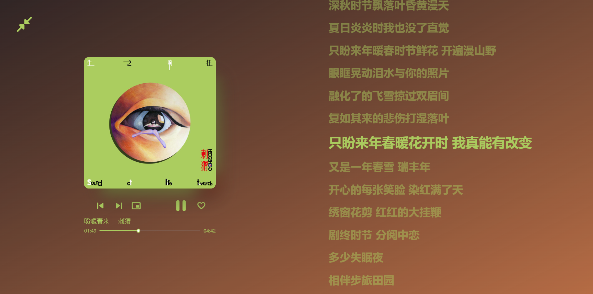

<h1 align="center" style="font-weight:600;">RoPlay</h1>

vue3 + vite + Pinia

## DEMO

[link](https://ro-play-vue3-69xxynv91-wskkku.vercel.app/#/)

<!-- ## 更新日志 -->

<!-- [更新日志](./docs/changLog.md) -->

## 使用方法

### 部署到自己的服务器

- 克隆本仓库
- 替换`/.env`文件中 `VITE_BASE_URL` 的值为你的网易云 API 地址
- 运行`yarn install`安装依赖
- 运行`yarn run build`打包

### 部署至 Vercel

- fork 并部署 [网易云音乐 api](https://github.com/Binaryify/NeteaseCloudMusicApi) 至 Vercel
- 点击 Environment Variables，填写 Name 为 `VITE_BASE_URL`，Value 为 你的网易云 API 地址.

## 介绍

### 特色

- 使用 vue3 + vite + Pinia 开发
- 响应式布局
- 无社交功能

### 截图

## 灵感来源

- [YesPlayMusic](https://github.com/qier222/YesPlayMusic)
- AppleMusic
- YoutubeMusic
- 网易云音乐
